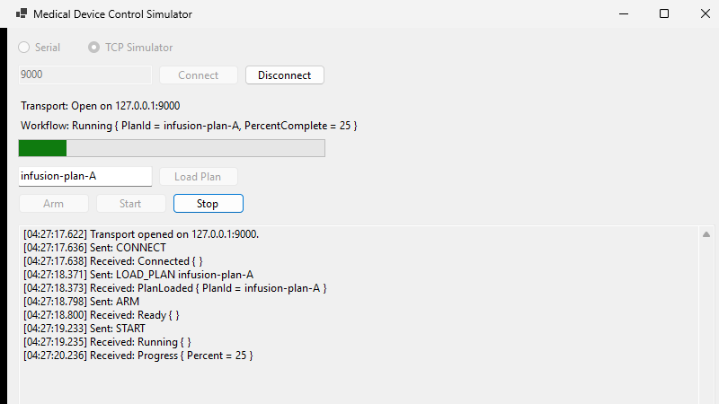
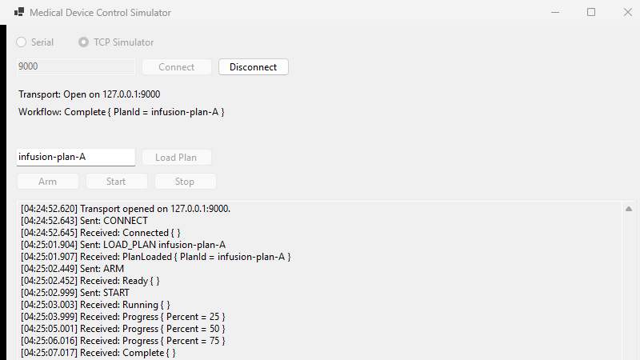

# Medical Device Control Simulator

A C# WinForms application that simulates clinical control software for a medical device, communicating over a real USB serial connection with a Flipper Zero acting as simplified test hardware. Built as a portfolio/learning project to develop C#/.NET, Windows desktop, and serial/network hardware interface skills.

**This is a portfolio and learning project. It is not clinical software, is not QMS-compliant, is not FDA-regulated, and must never be used for or represented as suitable for real medical/clinical purposes.** The Flipper Zero is simplified test hardware standing in for a real therapeutic device — it has no relationship to any real medical device.

## Screenshots

<table>
<tr>
<td width="50%">

**A treatment mid-run**, connected to `MedDeviceSim.Simulator` over TCP — live progress bar, timestamped event log, and workflow state (with plan ID and percent complete) all updating without further input.



</td>
<td width="50%">

**A full run to completion** — the event log shows the entire `CONNECT` → `Complete` exchange against the simulator, one line per command sent and response received.



</td>
</tr>
</table>

## What this demonstrates

- C# / .NET application development, including WinForms desktop UI
- Serial hardware communication (`System.IO.Ports`) with real USB hardware
- Network hardware communication (`System.Net.Sockets`) via a second transport implementation, including a standalone TCP device simulator
- A custom line-based command/response protocol, designed and implemented from scratch, shared across both transports
- A workflow/state machine enforcing valid operation sequences independent of the UI
- Automated unit and integration testing, including test doubles for hardware-free testing
- Incremental, evidence-driven engineering: every architectural decision below was made only after observing real behavior, not assumed in advance

## Architecture

The solution is split into several projects, each with one narrow responsibility:

| Project | Responsibility |
|---|---|
| `MedDeviceSim.Communication` | Serial and TCP transports (`SerialTransport`, `TcpTransport`, `ITransport`), byte-to-line framing (`LineReader`), and the protocol layer (`DeviceCommand`, `DeviceResponse`) |
| `MedDeviceSim.Workflow` | `TreatmentWorkflow` — a pure, synchronous state machine with no I/O. Fully testable without hardware or a UI. |
| `MedDeviceSim.Session` | `TreatmentSession` — bridges the workflow to a real transport: sends commands, reads responses, feeds them back into the workflow, translates communication failures into safe state transitions |
| `MedDeviceSim` | The WinForms UI, built on top of the above. Reflects workflow state; does not itself enforce validity — that's the workflow's job |
| `MedDeviceSim.Simulator` | `SimulatedDeviceServer` — an independent, stateful implementation of the protocol over TCP, used to test and demonstrate the real application against something that actually speaks it (see [Known limitations](#known-limitations)) |
| `MedDeviceSim.Simulator.Host` | A minimal standalone console app that runs `SimulatedDeviceServer` as its own process, for manual testing and demonstration against the live UI |
| `FlipperSerialExperiment` / `RawSerialExperiment` | Early diagnostic console apps used to observe real Flipper Zero serial behavior and debug a suspected `System.IO.Ports` issue before any reusable library code was written |

Dependency direction is strictly one-way: `MedDeviceSim` → `MedDeviceSim.Session` → `MedDeviceSim.Workflow` → `MedDeviceSim.Communication`. Nothing lower in that chain knows anything about the layer above it — `TreatmentWorkflow`, in particular, has zero knowledge that a UI, or even a real transport, exists.

## Workflow / state machine

```text
Disconnected → Connected → PlanLoaded → Armed → Running → Complete
                                  │         │
                                  └── Stop ─┴──→ Stopped
                any state (except Disconnected) ──Error──→ Fault
                            any state ──disconnect──→ Disconnected
```

Enforced entirely by `TreatmentWorkflow` (`MedDeviceSim.Workflow`), independent of the UI:

- `ARM` is rejected unless a plan has been loaded.
- `START` is rejected unless the device is armed.
- `LOAD_PLAN` is rejected while running.
- A lost connection — any communication failure, not just an explicit disconnect — immediately forces `Disconnected`, regardless of prior state.
- A device-reported error (the device replying while still reachable) forces a distinct `Fault` state instead, preserving the reason — reserved specifically for the device telling us something is wrong, not for losing the ability to talk to it at all. See [`docs/state-machine.md`](docs/state-machine.md) for the full transition set.

## Protocol

A custom line-based (`\r\n`-terminated) protocol over the serial connection:

| Command | Response(s) |
|---|---|
| `CONNECT` | `CONNECTED` |
| `LOAD_PLAN <id>` | `PLAN_LOADED <id>` |
| `ARM` | `READY` |
| `START` | `RUNNING`, then `PROGRESS <percent>` (repeated), then `COMPLETE` |
| `STOP` | `STOPPED` |
| `GET_STATUS` | *(not implemented anywhere yet — see [Known limitations](#known-limitations))* |
| any | `ERROR <reason>` |

Unrecognized or malformed lines parse to a distinct `Unknown` response rather than throwing — device output that doesn't match the protocol is treated as an expected possibility, not an exceptional one, since real hardware (see Known Limitations) routinely sends output the protocol doesn't define. See [`docs/protocol-spec.md`](docs/protocol-spec.md) for the full specification, including error format and framing rules.

## Getting started

Requires the .NET 10 SDK and Windows (the UI project targets `net10.0-windows` for WinForms).

```
dotnet build
dotnet test
```

Open `med-device-sim.slnx` in Visual Studio, or run the UI directly:

```
dotnet run --project MedDeviceSim
```

## Testing

68 automated tests across the library projects — pure logic (protocol parsing, state transitions, formatting) requiring no hardware, integration tests against `FakeTransport` (a controllable test double simulating timeouts, malformed lines, device errors, and disconnects), and integration tests against `MedDeviceSim.Simulator`'s real, independently-implemented protocol-aware device over a real TCP socket.

Two additional tests are hardware-gated (`[Fact(Skip = "requires a real Flipper Zero connected via USB")]`) and are run manually, with the Flipper connected. See [`docs/test-procedures.md`](docs/test-procedures.md) for exactly how to run these, what each test project covers, and the manual UI verification procedure.

The WinForms UI itself has been manually driven and verified against real hardware (via Windows UI Automation, not just visual inspection) for the connect/disconnect flow, event logging, and resource cleanup on close.

## Known limitations

- **`GET_STATUS` is not wired up end-to-end.** `DeviceCommand.GetStatus` exists, but `TreatmentWorkflow` never got a corresponding request method, since a status query doesn't fit the "valid from exactly one state" pattern the other commands share. Not yet resolved.
- **Formal design documentation is still in progress.** See [Documentation](#documentation) below for what exists so far.

Since the real Flipper Zero's stock CLI doesn't understand this custom protocol, the stock-hardware path can never move past `Connected` (`CONNECT` gets an unrecognized-command reply, not `CONNECTED`). To get a full `Connected → Complete` run against something real, `MedDeviceSim.Simulator` implements the protocol statefully (`SimulatedDeviceServer`, hosted standalone by `MedDeviceSim.Simulator.Host`), paired with `TcpTransport`, a second `ITransport` implementation alongside `SerialTransport`. The WinForms UI now runs a complete workflow — including live `PROGRESS` updates — against this simulator over a real TCP socket.

## Documentation

Lightweight, requirements-driven documentation, in progress:

- [`docs/requirements.md`](docs/requirements.md) — numbered requirements (`REQ-NNN`), extracted from behavior already implemented and tested, not aspirational.
- [`docs/protocol-spec.md`](docs/protocol-spec.md) — the command/response wire protocol: framing, commands, responses, error format, and known gaps.
- [`docs/state-machine.md`](docs/state-machine.md) — `TreatmentWorkflow`'s states and every transition, split into request validation vs. response-driven change.
- [`docs/architecture-decisions.md`](docs/architecture-decisions.md) — why the codebase is layered and built the way it is, decision by decision.
- [`docs/test-procedures.md`](docs/test-procedures.md) — how to run the automated suite, what each test project covers, and manual verification procedures (hardware-gated tests, UI against the simulator and real hardware).
- [`docs/traceability-matrix.md`](docs/traceability-matrix.md) — every requirement mapped to the test(s) that verify it, plus the coverage gaps that fell out of building it (the UI layer has no automated tests).

## Notable engineering findings along the way

- The Flipper Zero's USB CDC-ACM serial interface stays silent until the host asserts the DTR control line — undocumented behavior discovered empirically, not assumed.
- `System.IO.Ports.SerialPort`'s async `ReadAsync`/`WriteAsync` do not reliably honor `CancellationToken` on Windows in this environment — confirmed via an isolated diagnostic probe against real hardware, and worked around by falling back to the synchronous `Read`/`Write` methods (which do respect their configured timeouts) wrapped in `Task.Run`.
- The Flipper's CLI can be driven into an unresponsive state by rapid repeated connect/disconnect cycling, recoverable only by a physical power cycle — discovered during debugging, and now documented as an operational constraint for future hardware testing rather than assumed to be a code bug.
